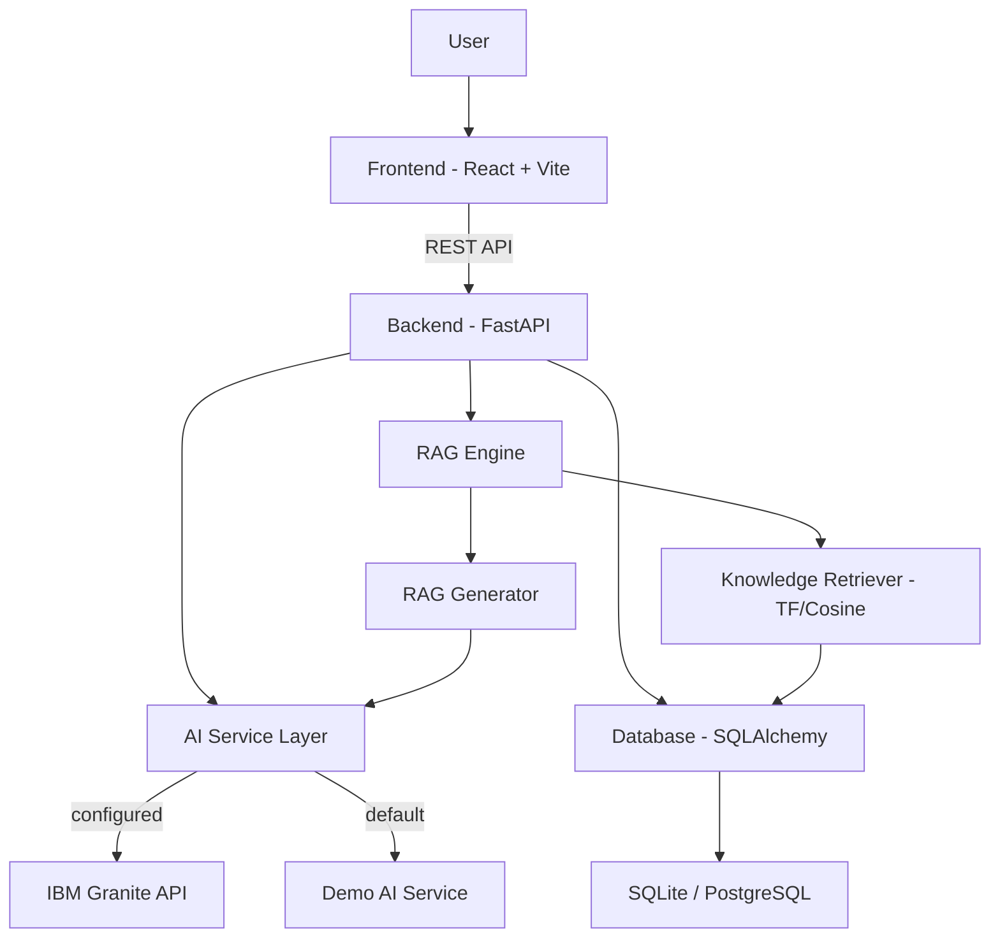

# EcoSphere AI

**AI-Powered Sustainable Waste Management & Awareness Assistant**

An intelligent web application that helps individuals, households, and communities identify, sort, and manage waste responsibly using artificial intelligence. Built to support **SDG 12 — Responsible Consumption and Production**.

---

## Problem Statement

Millions of tons of waste are generated globally each year, and a significant portion ends up in landfills due to improper segregation and lack of awareness. Individuals often lack the knowledge or tools to correctly classify waste, determine recyclability, or adopt sustainable practices in daily life. Existing waste management solutions are either too complex for individual users or lack educational value.

EcoSphere AI bridges this gap by providing an accessible, AI-powered assistant that classifies waste from images, answers sustainability questions through a RAG-powered chatbot, and delivers personalized recommendations for reducing environmental impact.

---

## Motivation

The project was motivated by the need to bring sustainable waste management awareness to individuals and communities through technology. By combining AI capabilities with an intuitive user interface, EcoSphere AI aims to:

- Democratize access to waste classification knowledge
- Encourage responsible consumption and production habits
- Make sustainability education interactive and engaging
- Empower users to measure and track their environmental impact
- Support the UN Sustainable Development Goals at a grassroots level

---

## SDG Alignment

### Primary: SDG 12 — Responsible Consumption and Production

EcoSphere AI directly supports SDG 12 by:
- Helping users identify waste types and recyclability (Target 12.5: substantially reduce waste generation)
- Educating users on proper disposal methods (Target 12.4: environmentally sound management of chemicals and wastes)
- Promoting the waste hierarchy: Reduce, Reuse, Recycle
- Tracking recycling rates and diversion from landfills

### Secondary: SDG 11 — Sustainable Cities and Communities

- Supports household-level waste management contributing to cleaner communities
- Encourages composting and local recycling programs

### Secondary: SDG 13 — Climate Action

- Highlights the CO₂ impact of waste decomposition in landfills
- Promotes composting to reduce methane emissions
- Tracks estimated CO₂ savings from proper waste handling

---

## Target Users

| User Group | How They Benefit |
|---|---|
| **Students** | Learn about waste management through interactive AI; complete sustainability assignments using real data |
| **Households** | Classify daily waste items; get personalized tips to reduce household waste |
| **Communities** | Track collective recycling rates; promote awareness programs |
| **Sustainability Learners** | Access a comprehensive knowledge base; ask the AI assistant any sustainability question |
| **Waste-Management Awareness Programs** | Use as a demo tool for workshops and campaigns; export analytics for reporting |

---

## AI Usage

EcoSphere AI integrates artificial intelligence across multiple features:

| Feature | AI Technique | Description |
|---|---|---|
| **Waste Image Scanner** | Image Analysis (Classification) | Classifies uploaded waste images into categories (plastic, paper, metal, glass, organic, electronic, hazardous, textile) with confidence scores |
| **AI Sustainability Assistant** | Retrieval-Augmented Generation (RAG) | Retrieves relevant knowledge base documents and generates contextual responses about waste management |
| **Sustainability Advisor** | Personalized Recommendation | Generates tailored suggestions based on household profile (size, waste generation, habits) |
| **Analytics Insights** | Data Analytics | Analyzes waste patterns, generates trends, and provides actionable insights |
| **Impact Calculator** | Estimation Engine | Calculates environmental impact metrics (CO₂ saved, diversion rate) based on analysis history |

The AI backend supports a pluggable architecture:
- **IBM Granite** (when API credentials are configured): Real LLM-powered responses
- **Demo Mode** (default): Deterministic, curated responses for reliable demonstration

---

## Architecture

```
┌─────────────────────────────────────────────────────────┐
│                      User (Browser)                      │
└────────────────────────┬────────────────────────────────┘
                         │
                         ▼
┌─────────────────────────────────────────────────────────┐
│                  Frontend (React + Vite)                  │
│  Pages: Landing, Dashboard, Scanner, Assistant, Advisor  │
│  Analytics, Impact, Knowledge, ResponsibleAI             │
└────────────────────────┬────────────────────────────────┘
                         │ REST API
                         ▼
┌─────────────────────────────────────────────────────────┐
│               Backend API (FastAPI + Python)              │
│  Routers: /api/auth, /api/analyze-image, /api/chat      │
│  /api/knowledge, /api/advisor, /api/analytics            │
└──────┬──────────────────┬──────────────────┬────────────┘
       │                  │                  │
       ▼                  ▼                  ▼
┌──────────────┐  ┌──────────────┐  ┌──────────────────┐
│  AI Service   │  │  RAG Engine   │  │   Database        │
│  (Granite /   │  │  Retriever +  │  │  (SQLite/         │
│   Demo Mode)  │  │  Generator    │  │   PostgreSQL)     │
└──────────────┘  └──────────────┘  └──────────────────┘
```

### Mermaid Diagram



---

## Tech Stack

### Frontend

| Technology | Purpose | Rationale |
|---|---|---|
| **React 19** | UI Library | Component-based architecture for building interactive UIs; latest stable version with performance improvements |
| **Vite 8** | Build Tool | Fast development server and optimized production builds; native ESM support |
| **TypeScript 6** | Type Safety | Catches errors at compile time; improves code maintainability and developer experience |
| **Tailwind CSS 4** | Styling | Utility-first CSS for rapid UI development; enables consistent design without custom CSS files |
| **React Router 7** | Navigation | Declarative routing for single-page application navigation |
| **Recharts 3** | Charts | Composable charting library for analytics visualizations (pie charts, bar charts) |
| **lucide-react** | Icons | Lightweight, tree-shakeable icon set with consistent design |
| **react-hot-toast** | Notifications | Non-intrusive toast notifications for user feedback |

### Backend

| Technology | Purpose | Rationale |
|---|---|---|
| **Python 3.14** | Runtime | Mature ecosystem for AI/ML; strong library support |
| **FastAPI 0.104** | Web Framework | High-performance async API framework; automatic OpenAPI docs; Pydantic validation |
| **SQLAlchemy 2.0** | ORM | Async-capable ORM; supports SQLite (dev) and PostgreSQL (production) |
| **Pydantic 2.5** | Data Validation | Fast serialization/deserialization; integrated with FastAPI |
| **Pydantic Settings** | Configuration | Environment variable management with type validation |
| **aiosqlite** | Async SQLite | Async driver for SQLite in development |
| **python-jose** | JWT Auth | JSON Web Token creation and verification for authentication |
| **passlib + bcrypt** | Password Hashing | Secure password storage with salted bcrypt hashing |
| **Pillow** | Image Processing | Image metadata extraction for demo mode analysis |
| **httpx** | HTTP Client | Async HTTP client for IBM Granite API calls |
| **aiofiles** | Async File I/O | Non-blocking file operations for uploads |

---

## Installation

### Prerequisites

- Python 3.10+
- Node.js 18+ (and npm)
- Git

### Backend Setup

```bash
# Clone the repository
git clone https://github.com/PrinceInTech/ecosphere-ai.git
cd ecosphere-ai/backend

# Create a virtual environment
python -m venv venv

# Activate the virtual environment
# Windows (PowerShell):
.\venv\Scripts\Activate.ps1
# macOS/Linux:
source venv/bin/activate

# Install dependencies
pip install -r requirements.txt

# Copy environment variables
cp .env.example .env

# Start the backend server
uvicorn app.main:app --reload --host 0.0.0.0 --port 8000
```

The backend starts at `http://localhost:8000`. API documentation is available at `http://localhost:8000/docs`.

### Frontend Setup

```bash
# Navigate to frontend directory
cd ../frontend

# Install dependencies
npm install

# Start the development server on port 5174
npm run dev -- --port 5174 --strictPort
```

The frontend starts at `http://localhost:5174`.

---

## Environment Variables

| Variable | Default | Description |
|---|---|---|
| `DEMO_MODE` | `true` | Enable demo mode (uses local curated responses instead of external AI) |
| `DATABASE_URL` | `sqlite+aiosqlite:///./ecosphere.db` | Database connection string (SQLite for dev, PostgreSQL for prod) |
| `SECRET_KEY` | `change-me-in-production` | JWT signing secret — **must be changed in production** |
| `IBM_GRANITE_API_KEY` | `""` | IBM Granite API key for real AI responses |
| `IBM_GRANITE_URL` | `""` | IBM Granite API endpoint URL |
| `ACCESS_TOKEN_EXPIRE_MINUTES` | `60` | JWT token expiration time in minutes |
| `MAX_UPLOAD_SIZE` | `10485760` (10MB) | Maximum file upload size in bytes |
| `ALLOWED_EXTENSIONS` | `jpg,jpeg,png,gif,webp` | Allowed image file extensions |
| `CORS_ORIGINS` | `http://localhost:5173,http://localhost:5174,http://localhost:3000,https://ecosphere-ai-frontend-got0.onrender.com` | Allowed CORS origins |
| `VITE_API_BASE_URL` | `http://localhost:8000/api` (dev) | Frontend API base URL (should include the `/api` prefix). Dev default points at your local backend; set `https://ecosphere-ai-backend.onrender.com/api` in the Render dashboard only — never bake prod into local dev. |

---

## Running the Application

### Development Mode

**Terminal 1 — Backend:**
```bash
cd backend
uvicorn app.main:app --reload --host 0.0.0.0 --port 8000
```

**Terminal 2 — Frontend:**
```bash
cd frontend
npm run dev -- --port 5174 --strictPort
```

Open `http://localhost:5174` in your browser.

### Docker Compose

```bash
# From the project root
docker-compose up --build
```

- Frontend: `http://localhost:3000`
- Backend API: `http://localhost:8000`
- API Documentation: `http://localhost:8000/docs`

---

## API Documentation

Once the backend is running, visit `http://localhost:8000/docs` for interactive Swagger documentation.

### Endpoints Overview

| Method | Endpoint | Description |
|---|---|---|
| `GET` | `/api/health` | Health check |
| `GET` | `/api/demo-status` | Current demo mode status |
| `POST` | `/api/auth/register` | Register a new user |
| `POST` | `/api/auth/login` | Login and receive JWT token |
| `GET` | `/api/auth/me` | Get current authenticated user |
| `POST` | `/api/analyze-image` | Upload and analyze a waste image |
| `GET` | `/api/history` | Get analysis history |
| `GET` | `/api/analytics` | Get waste analytics summary |
| `GET` | `/api/impact` | Get environmental impact metrics |
| `POST` | `/api/chat` | Send a message to the AI assistant |
| `GET` | `/api/conversations` | List chat conversations |
| `GET` | `/api/conversations/{id}/messages` | Get messages in a conversation |
| `GET` | `/api/knowledge` | List knowledge base documents |
| `POST` | `/api/knowledge` | Add a new knowledge document |
| `POST` | `/api/knowledge/search` | Search the knowledge base |
| `POST` | `/api/advisor` | Get personalized sustainability recommendations |

See [docs/api.md](docs/api.md) for detailed request/response examples.

---

## Demo Mode

EcoSphere AI runs in **demo mode by default** (`DEMO_MODE=true`). In demo mode:

- **Image Analysis**: Uses a local classification system with curated waste responses based on filename keywords and image hashing. Does not require external AI APIs.
- **Chat Assistant**: Provides pre-written, factually accurate sustainability responses matched by keyword. Responses include general guidance sourced from the knowledge base.
- **Advisor**: Generates rule-based recommendations tailored to the user's input profile.

When IBM Granite API credentials are configured (`IBM_GRANITE_API_KEY` and `IBM_GRANITE_URL`), the system switches to real LLM-powered responses while falling back to demo mode on errors.

A `DemoBadge` component is displayed across the UI to transparently indicate when the app is operating in demo mode.

---

## Testing

### Backend Tests

```bash
cd backend
python -m pytest tests/ -v
```

The test suite includes 16 tests covering:
- Health and demo status endpoints
- Image upload and analysis (valid and invalid types)
- Chat messaging and conversation management
- Knowledge base CRUD and search
- Sustainability advisor
- Analytics and impact endpoints
- User authentication (register, login, profile)

### Frontend Checks

```bash
cd frontend
npm run lint      # Run oxlint
npm run build     # Type-check and build
```

See [docs/testing.md](docs/testing.md) for the full testing documentation and manual testing checklist.

---

## Responsible AI

EcoSphere AI is built on foundational principles of responsible AI:

- **Transparency**: All AI outputs show confidence levels; demo mode is clearly labeled
- **Data Privacy**: Uploaded images are validated and stored temporarily; no personal data is exposed
- **Fairness**: Recommendations are general and avoid biased assumptions about users
- **Ethics & Safety**: Hazardous waste guidance is safety-first; no harmful instructions are generated
- **Honest AI Claims**: No fabricated claims about AI model usage; demo mode is honest about its nature
- **No Fabricated Facts**: Knowledge base content is labeled as general guidance; local rules are not assumed

See [docs/responsible-ai.md](docs/responsible-ai.md) for the complete Responsible AI documentation.

---

## Limitations

1. **Demo Mode Accuracy**: In demo mode, waste classification is based on filename keywords and image properties, not actual visual recognition. Results are illustrative rather than accurate.
2. **Knowledge Base Scope**: The knowledge base contains general sustainability guidance. It does not cover all local regulations or regional waste management specifics.
3. **Impact Estimates**: Environmental impact metrics (CO₂ savings, diversion rates) are calculated using simplified assumptions and are not scientifically validated measurements.
4. **No Real-Time Processing**: Image analysis is synchronous and does not use computer vision models in demo mode.
5. **Single-User Focus**: The current architecture is designed for individual use; multi-tenant or enterprise features are not yet implemented.
6. **No Image Storage Privacy Controls**: Uploaded images are stored on the server filesystem without encryption at rest.

---

## Future Scope

1. **Computer Vision Integration**: Integrate actual image classification models (e.g., TensorFlow, PyTorch) for real waste recognition from photos
2. **IBM Granite Full Integration**: Complete the IBM Granite API integration for production-grade AI responses
3. **Multi-Language Support**: Add localization for Hindi, Tamil, and other regional languages to broaden accessibility
4. **Community Features**: Enable community dashboards, leaderboards, and collaborative waste tracking
5. **Mobile Application**: Develop a React Native or Flutter mobile app for on-the-go scanning
6. **IoT Integration**: Connect with smart bins and sensors for automated waste tracking
7. **Municipal Integration**: Partner with local waste management authorities for region-specific disposal guides
8. **Gamification**: Add points, badges, and challenges to encourage sustained sustainable behavior
9. **Advanced Analytics**: Implement predictive analytics for waste generation patterns
10. **API for Third Parties**: Expose APIs for schools, NGOs, and municipal programs to integrate waste awareness tools

---

## Expected Impact

When deployed and used at scale, EcoSphere AI can contribute to:

- **Increased Awareness**: Individuals gain understanding of proper waste segregation and disposal
- **Behavior Change**: Personalized recommendations encourage adoption of sustainable habits
- **Reduced Landfill Waste**: Better classification leads to more items being recycled or composted
- **Community Engagement**: Shared analytics and knowledge base foster community-wide sustainability efforts
- **SDG 12 Progress**: Direct contribution to Responsible Consumption and Production targets
- **Educational Value**: Students and educators gain an interactive tool for sustainability education

---

## License

This project was developed as part of the **1M1B AI for Sustainability** internship program in collaboration with **IBM SkillsBuild** and **AICTE**.

---

## Acknowledgments

- **1M1B (One Million Billion)** for the AI for Sustainability internship program
- **IBM SkillsBuild** for AI education resources and Granite API access
- **AICTE** for academic framework support
- Open-source communities behind FastAPI, React, SQLAlchemy, and all dependencies
