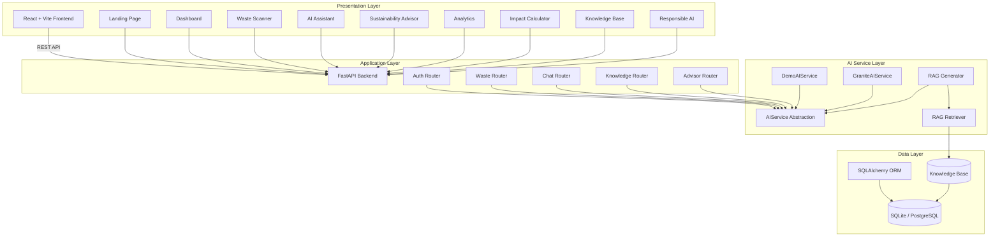
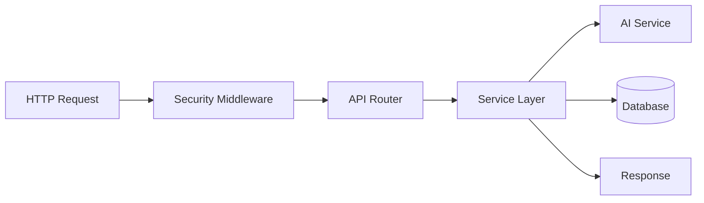
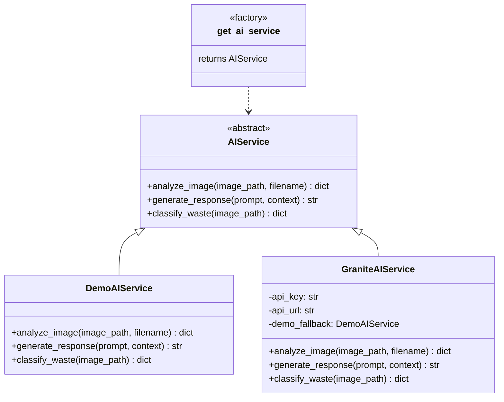
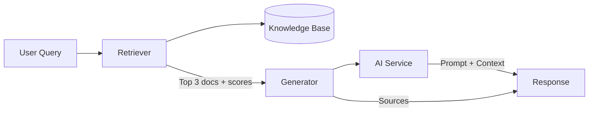
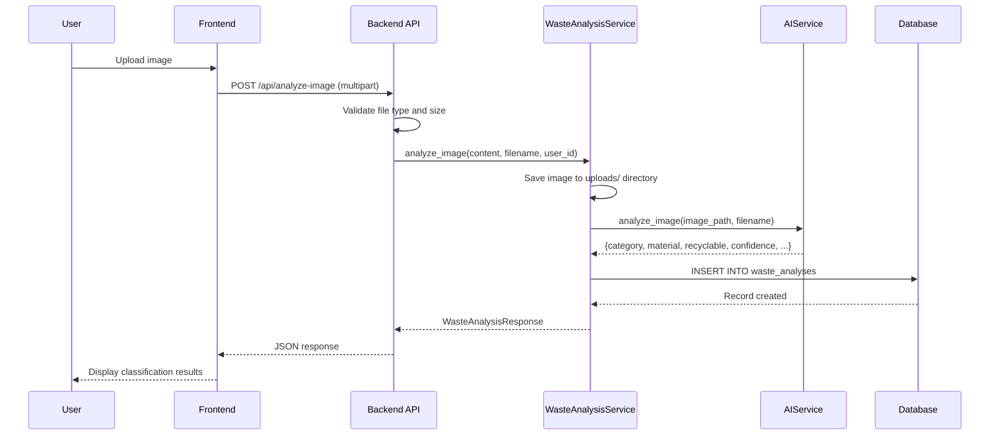
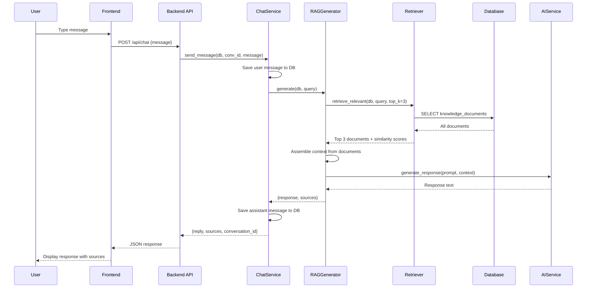
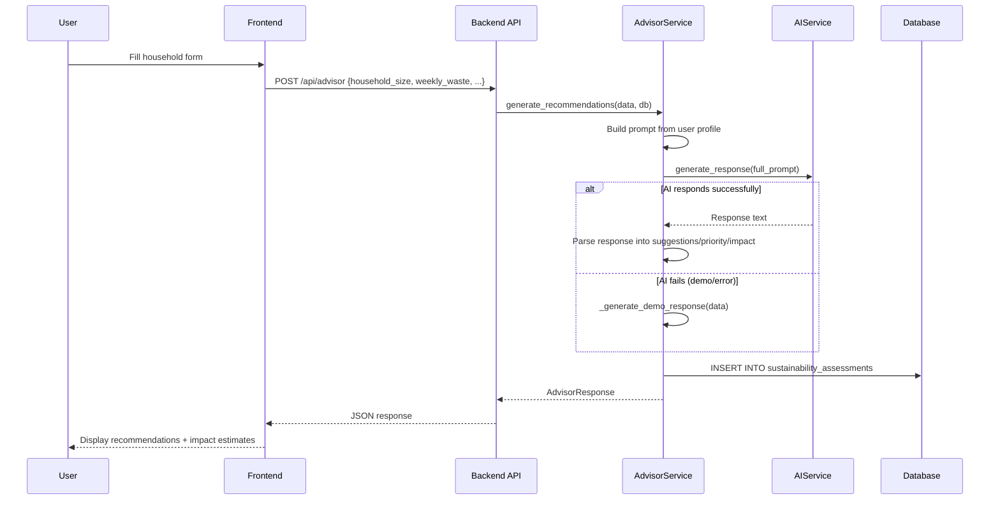
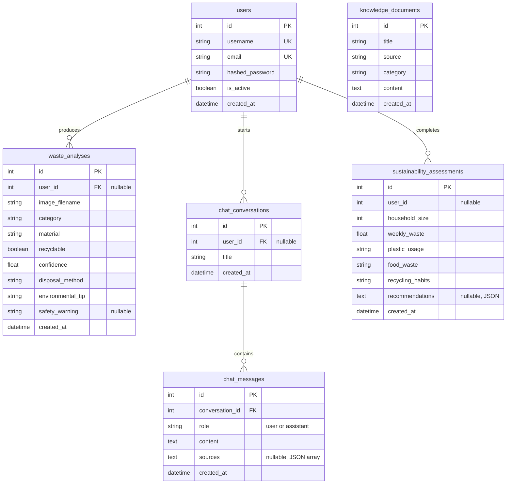
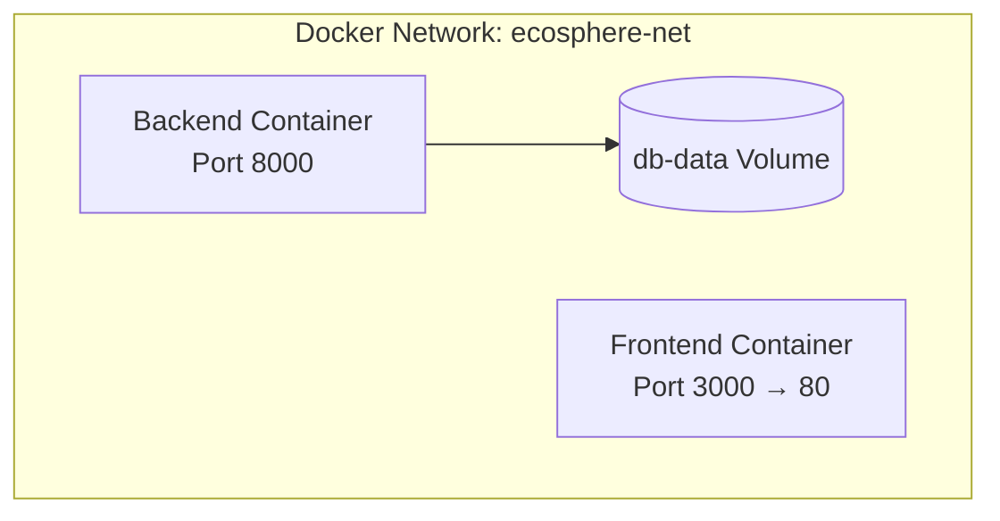

# EcoSphere AI — Architecture Documentation

## High-Level Architecture

EcoSphere AI follows a three-tier architecture: Presentation Layer (Frontend), Application Layer (Backend API), and Data Layer (Database + Knowledge Base). The AI functionality is implemented as a pluggable service layer that abstracts the underlying AI provider.



---

## System Components

### 1. Frontend (React + Vite + TypeScript)

**Location**: `frontend/src/`

The frontend is a single-page application (SPA) built with React 19, Vite 8, and TypeScript 6. It communicates with the backend exclusively through REST API calls defined in `frontend/src/services/api.ts`.

**Routing**: React Router 7 handles client-side routing with the following routes:

| Route | Page Component | Purpose |
|---|---|---|
| `/` | Landing | Marketing page with feature overview |
| `/dashboard` | Dashboard | Summary statistics and quick actions |
| `/scanner` | Scanner | Waste image upload and analysis |
| `/assistant` | Assistant | AI-powered chat interface |
| `/advisor` | Advisor | Household sustainability assessment form |
| `/analytics` | Analytics | Charts and data visualizations |
| `/impact` | Impact | Environmental impact metrics |
| `/knowledge` | Knowledge | Searchable knowledge base documents |
| `/responsible-ai` | ResponsibleAI | AI principles and transparency documentation |

**Component Architecture**:

```
src/
├── components/
│   ├── Layout.tsx          # Main layout with header, nav, footer
│   ├── LoadingSpinner.tsx  # Reusable loading indicator
│   ├── EmptyState.tsx      # Empty state placeholder
│   ├── ResultCard.tsx      # Waste analysis result display
│   └── DemoBadge.tsx       # Demo mode indicator badge
├── pages/                  # 9 page components
├── services/
│   └── api.ts              # All API client functions
└── types/
    └── index.ts            # TypeScript interfaces
```

**Key Design Decisions**:
- All API calls go through a centralized `request<T>()` function in `api.ts` for consistent error handling
- TypeScript interfaces match Pydantic schemas for type safety across the stack
- Toast notifications provide non-intrusive user feedback via `react-hot-toast`
- Charts use Recharts with a consistent green/teal color palette matching the sustainability theme

---

### 2. Backend (FastAPI + Python)

**Location**: `backend/app/`

The backend is an async Python application built with FastAPI. It uses SQLAlchemy 2.0 with async support for database operations and Pydantic 2.5 for request/response validation.

**Request Flow**:



**Module Structure**:

```
backend/app/
├── main.py                  # FastAPI app creation, lifespan, router registration
├── config.py                # Pydantic Settings configuration
├── api/
│   ├── auth.py              # /api/auth/* endpoints
│   ├── waste.py             # /api/analyze-image, /api/history, /api/analytics, /api/impact
│   ├── chat.py              # /api/chat, /api/conversations/*
│   ├── knowledge.py         # /api/knowledge/*
│   └── advisor.py           # /api/advisor
├── models/
│   ├── user.py              # User model
│   ├── waste_analysis.py    # WasteAnalysis model
│   ├── chat.py              # ChatConversation + ChatMessage models
│   ├── knowledge.py         # KnowledgeDocument model
│   └── sustainability_assessment.py  # SustainabilityAssessment model
├── schemas/
│   ├── user.py              # UserCreate, UserLogin, UserResponse, Token
│   ├── waste.py             # WasteAnalysisCreate, WasteAnalysisResponse
│   ├── chat.py              # ChatRequest, ChatResponse, ConversationResponse
│   ├── knowledge.py         # KnowledgeDocumentCreate/Response, SearchRequest/Response
│   ├── advisor.py           # AdvisorRequest, AdvisorResponse
│   └── analytics.py         # AnalyticsResponse, ImpactResponse, TopMaterialItem
├── services/
│   ├── auth.py              # JWT creation, password hashing, user retrieval
│   ├── waste_analysis.py    # Image analysis orchestration
│   ├── chat.py              # Conversation and message management
│   ├── knowledge.py         # Knowledge base CRUD and search
│   ├── advisor.py           # Recommendation generation
│   └── analytics.py         # Analytics aggregation and insights
├── ai/
│   ├── base.py              # AIService abstract class
│   ├── factory.py           # get_ai_service() factory function
│   ├── demo_service.py      # DemoAIService (curated local responses)
│   ├── granite_service.py   # GraniteAIService (IBM Granite API)
│   └── prompts/
│       ├── sustainability_assistant.py
│       ├── advisor.py
│       ├── waste_classification.py
│       └── insights.py
├── rag/
│   ├── retriever.py         # TF-based document retrieval with cosine similarity
│   └── generator.py         # RAG prompt assembly and response generation
├── database/
│   └── connection.py        # Async engine, session factory, Base, init_db()
├── middleware/
│   └── security.py          # CORS, security headers, request logging
└── seed_data.py             # Initial knowledge base documents (9 articles)
```

---

### 3. AI Service Layer

The AI service layer uses the **Abstract Factory + Strategy pattern** to allow switching between AI providers without changing any calling code.



**Decision Logic** (`ai/factory.py`):
1. If `DEMO_MODE=true` → return `DemoAIService`
2. Else if `IBM_GRANITE_API_KEY` and `IBM_GRANITE_URL` are set → return `GraniteAIService`
3. Otherwise → return `DemoAIService` (fallback)

**DemoAIService** uses:
- Filename keyword matching + image property analysis (dimensions, aspect ratio via Pillow) for classification
- A curated dictionary of 15+ waste item responses with factual disposal information
- Keyword-matched chat responses for common sustainability topics (20+ topics)
- MD5 hashing of filenames for deterministic variation in confidence scores

**GraniteAIService** uses:
- HTTP calls to IBM Granite API (`ibm/granite-3-8b-instruct` model) via httpx
- Falls back to DemoAIService on any API error
- Parses JSON responses from the LLM for waste classification

---

### 4. RAG (Retrieval-Augmented Generation)

The RAG system enhances chat responses by retrieving relevant knowledge base documents before generating responses.



**Retriever** (`rag/retriever.py`):
- Tokenizes the user query and all knowledge documents
- Computes Term Frequency (TF) vectors for each
- Calculates cosine similarity between query and each document
- Returns top-K documents ranked by similarity score

**Generator** (`rag/generator.py`):
- Assembles retrieved document titles and content as context
- Constructs a prompt combining the system prompt, context, and user query
- Calls the AI service to generate a response
- Returns the response along with source references

**Knowledge Base** (`seed_data.py`):
- 9 pre-seeded articles covering: waste segregation, recycling guidelines, plastic waste, e-waste, composting, hazardous waste, sustainable consumption, SDG 12, and water conservation
- Each article has: title, source, category, and content
- Users can add custom documents through the Knowledge page
- Search uses keyword overlap scoring for filtering

---

## Data Flow Descriptions

### Flow 1: Waste Image Analysis



### Flow 2: Chat with RAG



### Flow 3: Sustainability Advisor



---

## Database Schema

### Entity Relationship Diagram



### Table Descriptions

**`users`**: Stores registered user accounts. Authentication uses bcrypt password hashing and JWT tokens. Users are optional for most features (the app works without authentication).

**`waste_analyses`**: Records each waste image analysis including the AI's classification result. Stores the uploaded image filename, category, material, recyclability status, confidence score, disposal method, environmental tip, and optional safety warning.

**`chat_conversations`**: Groups chat messages into conversations. Auto-titles are generated from the first user message.

**`chat_messages`**: Individual messages within a conversation. Stores the role (user/assistant), content, and optional JSON-serialized source references for RAG responses.

**`knowledge_documents`**: The knowledge base that powers RAG retrieval. Seeded with 9 sustainability articles on startup. Extensible through the API and Knowledge page.

**`sustainability_assessments`**: Records household sustainability assessments submitted through the Advisor. Stores input parameters and generated recommendations for analytics.

---

## Middleware

Three middleware layers are applied to every request:

1. **CORS Middleware**: Allows configured origins (`localhost:5173`, `localhost:5174`, `localhost:3000`) to make cross-origin requests with credentials
2. **Security Headers Middleware**: Adds HTTP security headers (`X-Content-Type-Options`, `X-Frame-Options`, `X-XSS-Protection`, `Strict-Transport-Security`, `Referrer-Policy`)
3. **Request Logging Middleware**: Logs method, path, status code, and response time for every request

---

## Deployment Architecture

### Docker Compose



- **Backend Container**: Built from `backend/Dockerfile`; runs FastAPI with uvicorn; data persisted in `db-data` volume
- **Frontend Container**: Built from `frontend/Dockerfile`; serves static build via nginx on port 80
- **Network**: Bridge network `ecosphere-net` connects both services
- **Database Persistence**: Named volume `db-data` ensures SQLite data survives container restarts
